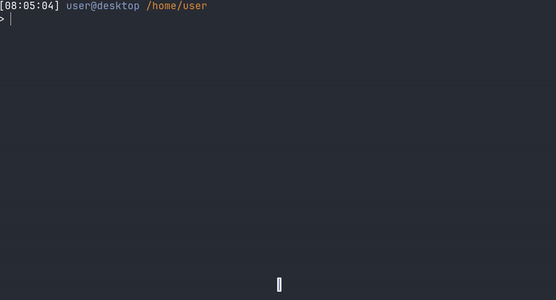

# Krypto

  

**Krypto cli** - приложение для отслеживания рынка криптовалюты

Приведенный выше пример выполняется из одного 

## API ENDPOINTS 
`/coins/list` — нужен один раз при настройке программы (или при обновлении списка монет), чтобы создать словарь "Символ -> ID".

`/simple/price` — нужен каждый раз, когда пользователь хочет узнать актуальную цену.
